# Task Tracker

## Функции
- Создание пользователей, проектов, задач (через Swagger)
- Фильтры по статусу, приоритету, исполнителю
- Сводка «Загрузка по проектам»
- Сводка «Задачи пользователя»

## Как запустить
1. Клонируем репозиторий  
```git clone https://github.com/APArunakyan/ArtPar_NW_CP2025.git```
2. Через консоль входим в пространство проекта  
```cd ArtPar_NW_CP2025```
3. Запускаем приложение  
```sudo docker-compose up --build```
4. Открываем проект в браузере  
   http://localhost:8000 - главная страница с задачами, фильтрами, сводками  
   http://localhost:8000/docs - Swagger UI

## Как пользоваться сайтом

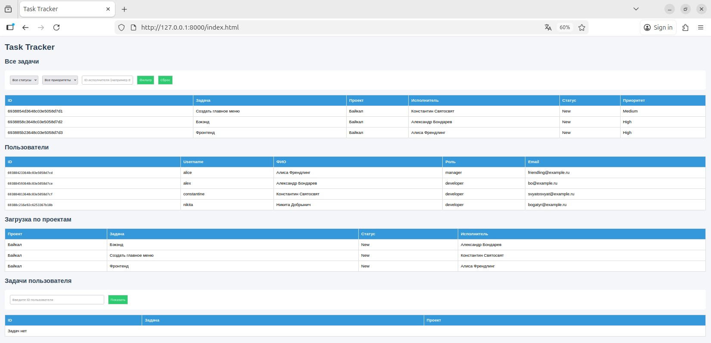

На сайте представлены таблицы со следующей информацией (сверху вниз):
- Данные о задачах пользователей
- Данные о пользователях
- Данные по загрузке по проектам
- Данные о задачах конкретного пользователя
  
Вам доступен просмотр и фильтрация этих данных.

#### Работа с фильтрами
- В таблице "Все задачи" возможна фильтрация задач по статусу,приоритету и id пользователя (его вы можете взять из таблицы пользователей).
  
  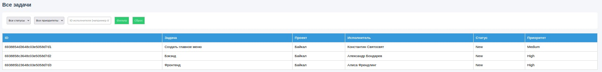
  
  При выборе соответствующего фильтра нажмите на кнопку "Фильтр" - после этого в таблице будут отображены только те задачи, которые соответствуют примененному фильтру.
  
  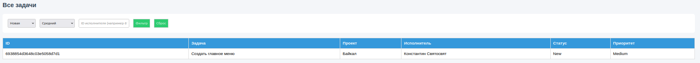
  
  При нажатии на кнопку "Сброс" таблица возвращает все задачи обратно.


- В таблице "Задачи пользователя" возможен просмотр всех задач выбранного пользователя.
  
  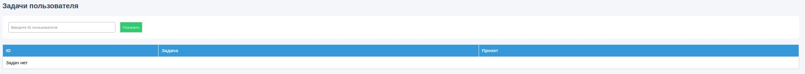
  
  Необходимо ввести соотвествующий id пользователя. После этого будет в таблице будет представлена информация о всех задачах данного пользователя.
  
  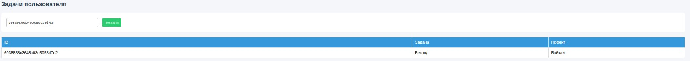  

## Как пользоваться Swagger

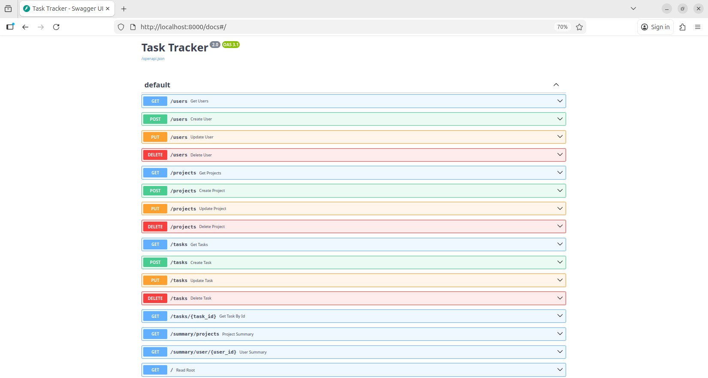

В Swagger UI вам представлена база данных о всех пользователях, проектах и задачах.

Здесь можно производить следующие действия с элементами базы:

1. Создание пользователей, проектов и задач (POST)
   - Кликните на интересующую категорию POST  

   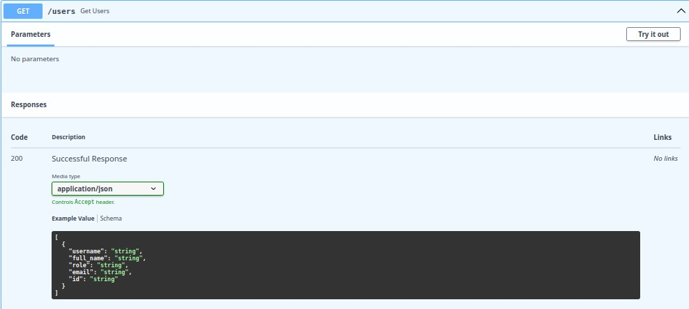

   - Нажмите на "Try it out"  
   - Внизу станет доступен шаблон, в котором вы сможете заполнить данные о новом элементе базы  

   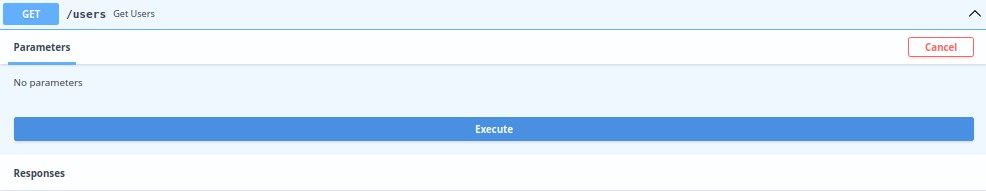

   - Нажмите на "Execute"  
   - Готово! Элемент будет сохранен в базу. Для выхода из окна нажмите "Cancel"  

   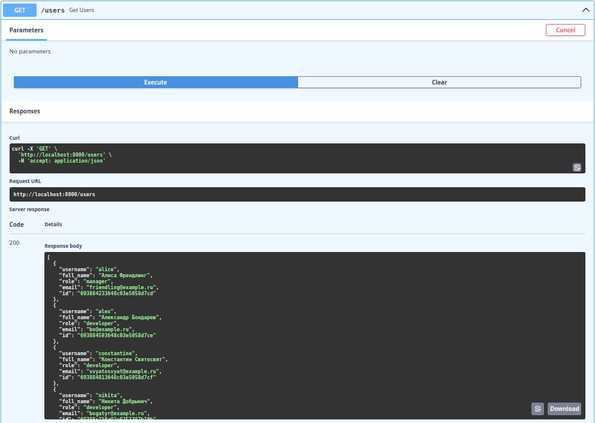

1. Получение информации о пользователях, проектах или задачах (GET)
   - Кликните на интересующую категорию GET  

   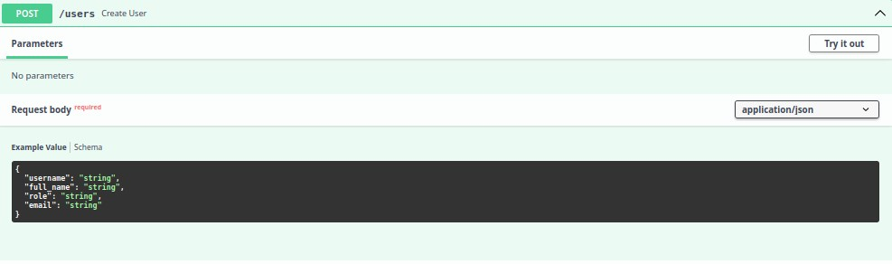

   - Нажмите на "Try it out"  

   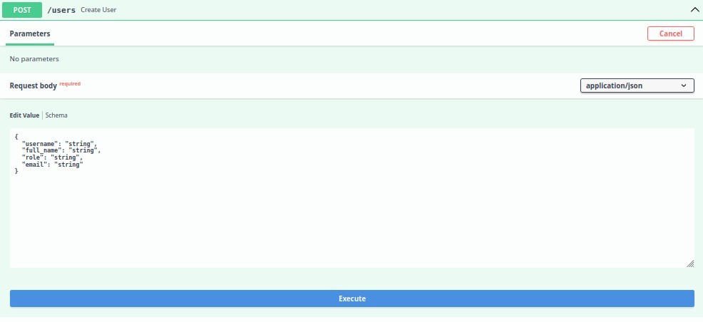

   - Нажмите на "Execute"  
   - Готово! Ниже вам будет представлена информация о всех элементах этой категории. Для выхода из окна нажмите "Cancel"  

   

   - Специально для задач существует отдельная кнопка GET /task{task_id}. Эта возможность была предоставлена для более удобного поиска задач (так как другая функция GET /tasks используется в фильтре). В этом случае вам будет необходимо просто заполнить id интересующей задачи и нажать на Execute. Вам будет представлена информация о конкретной задаче. Для выхода из окна нажмите Cancel  
2. Редактирование информации о пользователях, проектах или задачах (PUT)
   - Кликните на интересующую категорию PUT  

   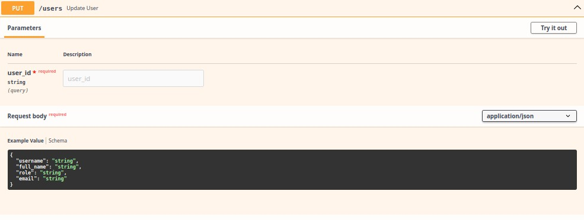

   - Нажмите на "Try it out"  
   - Введите id нужного элемента (его вы можете взять на сайте) и данные об данном элементе с внесением необходимых изменений  

   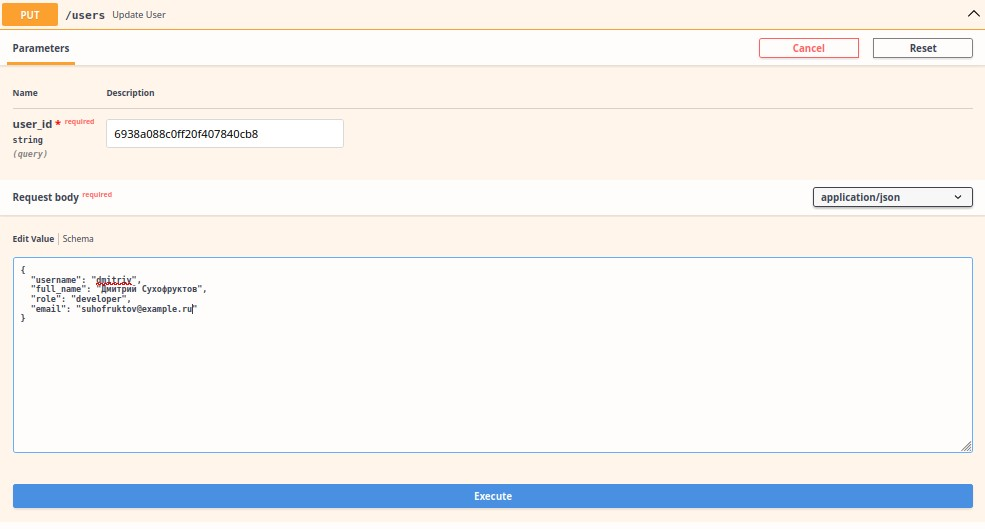

   - Нажмите на "Execute"  
   - Готово! Элемент будет изменен. Для выхода из окна нажмите "Cancel"  

   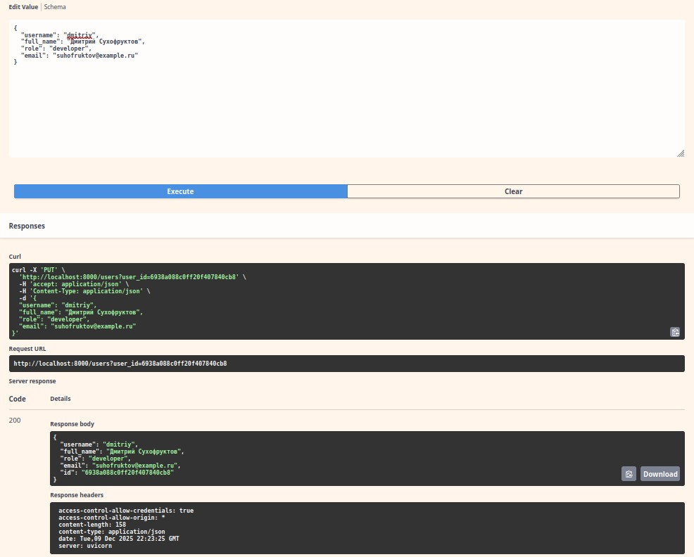

3. Удаление информации о пользователях, проектах или задачах (DELETE)
   - Кликните на интересующую категорию DELETE  

   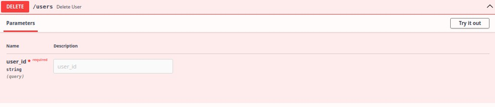

   - Нажмите на "Try it out"  
   - Введите id нужного элемента  

   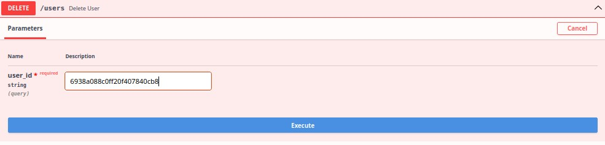

   - Нажмите на "Execute"  
   - Готово! Элемент будет удален из базы. Для выхода из окна нажмите "Cancel"  

   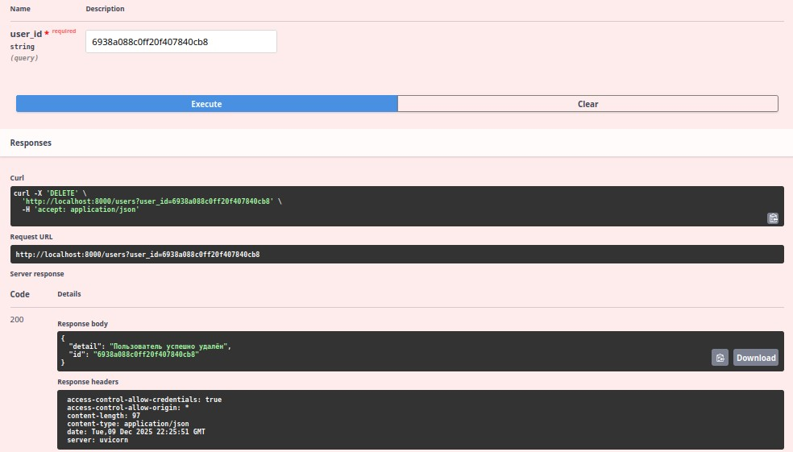  

### Приятного пользования!
